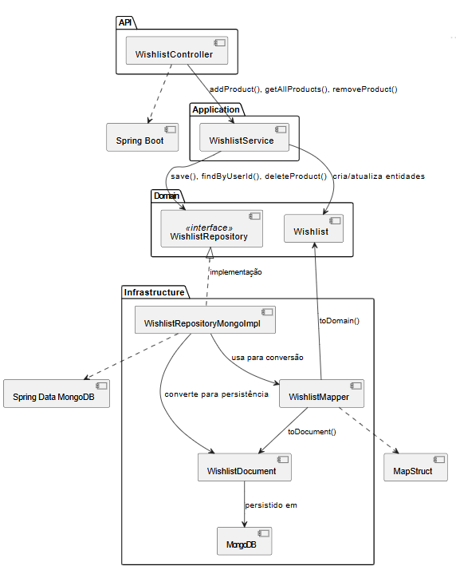

# WishlistRms

Desafio Técnico desenvolvido por Renato Mendes.

## Sumário

- [Descrição](#descrição)
- [Tecnologias Utilizadas](#tecnologias-utilizadas)
- [Como Executar](#como-executar)
    - [Execução Local](#execução-local)
    - [Execução com Docker](#execução-com-docker)
- [Exemplos de Uso da API](#exemplos-de-uso-da-api)
- [Estrutura do Projeto](#estrutura-do-projeto)
- [Arquitetura da Solução](#arquitetura-da-solução)
- [Fluxo de Funcionamento](#fluxo-de-funcionamento)
- [Testes](#testes)
- [Autor](#autor)

---

## Descrição

O **WishlistRms** é uma aplicação Java com Spring Boot para gerenciamento de listas de desejos (wishlists) de clientes. Utiliza MongoDB como banco de dados e segue boas práticas de desenvolvimento, incluindo testes automatizados (JUnit, Cucumber) e cobertura de código com Jacoco.

---

## Tecnologias Utilizadas

- **Java 21**
- **Spring Boot 3.5.6**
- **MongoDB**
- **MapStruct**
- **JUnit 5**
- **Cucumber**
- **Jacoco** (cobertura de testes)

---

## Como Executar

### Execução Local

. **Clone o repositório:**
   ```bash
   git clone https://github.com/RenatoMendes-RM/WishlistRms.git
   cd WishlistRms
   ```

. **Configure a variável de ambiente do MongoDB:**

- Windows (CMD):
  ```cmd
  set SPRING_DATA_MONGODB_URI=mongodb://localhost:27018/wishlists
  ```
- Git Bash/Linux/Mac:
  ```bash
  export SPRING_DATA_MONGODB_URI="mongodb://localhost:27018/wishlists"
  ```

. **Suba o MongoDB com Docker:**
   ```bash
   docker run -d --name mongo-wishlist-local -p 27018:27017 mongo:latest
   ```

. **Execute a aplicação:**
   ```bash
   mvn clean install
   mvn spring-boot:run
   ```
Acesse em: [http://localhost:8080](http://localhost:8080)

### Execução com Docker

. Gere o jar da aplicação:
   ```bash
   mvn clean package
   ```

. Suba tudo com Docker Compose:
   ```bash
   docker-compose up --build
   ```

. Para encerrar:
   ```bash
   docker-compose down
   ```

---

## Exemplos de Uso da API

| Método | Endpoint                                      | Descrição                        |
|--------|-----------------------------------------------|----------------------------------|
| POST   | `/api/wishlists/{customerId}/products/{productId}` | Adiciona produto à wishlist      |
| DELETE | `/api/wishlists/{customerId}/products/{productId}` | Remove produto da wishlist       |
| GET    | `/api/wishlists/{customerId}/products`        | Lista todos os produtos          |
| GET    | `/api/wishlists/{customerId}/products/{productId}` | Verifica se produto está na lista|

**Exemplo de requisição para adicionar produto:**
```bash
curl -X POST http://localhost:8080/api/wishlists/cliente1/products/produto123
```

---

## Estrutura do Projeto


```
src/
├── main/
│ ├── java/
│ │ └── org/projeto/
│ │ ├── WishListApp.java
│ │ ├── application/services/
│ │ ├── domain/entities/
│ │ ├── domain/repositories/
│ │ ├── infrastructure/persistence/
│ │ ├── infrastructure/repositories/
│ │ └── interfaces/api/controllers/
│ └── resources/
└── test/
└── java/
└── org/projeto/wishlistrms/bdd/
```

## Arquitetura da Solução

O projeto segue uma arquitetura inspirada na Clean Architecture, separando responsabilidades em camadas:


## Fluxo de Funcionamento

Exemplo: Adicionar produto à wishlist


## Diagrama de componentes



## Diagrama de Classes


## Diagrama de Atividades (inclusão de produto)


## Diagrama de Atividades (remoção de produto)


## Diagrama de Atividades (Listar todos itens da Wishlist do cliente)


## Diagrama de Atividades (Verificar produto na Wishlist)


## Testes

Para rodar os testes automatizados (JUnit e Cucumber):

```
   mvn test
```
Relatórios de cobertura Jacoco em target/site/jacoco/index.html.


## Autor

Renato Mendes  
<a href="https://www.linkedin.com/in/engrenatomendes/" target="_blank">

</a>


Desenvolvido como parte de um desafio técnico.


.
